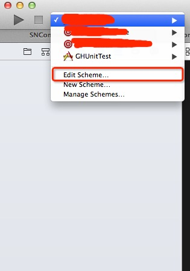
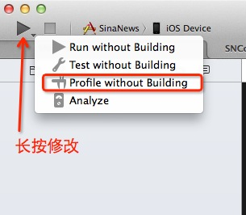
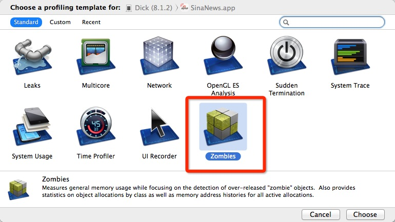
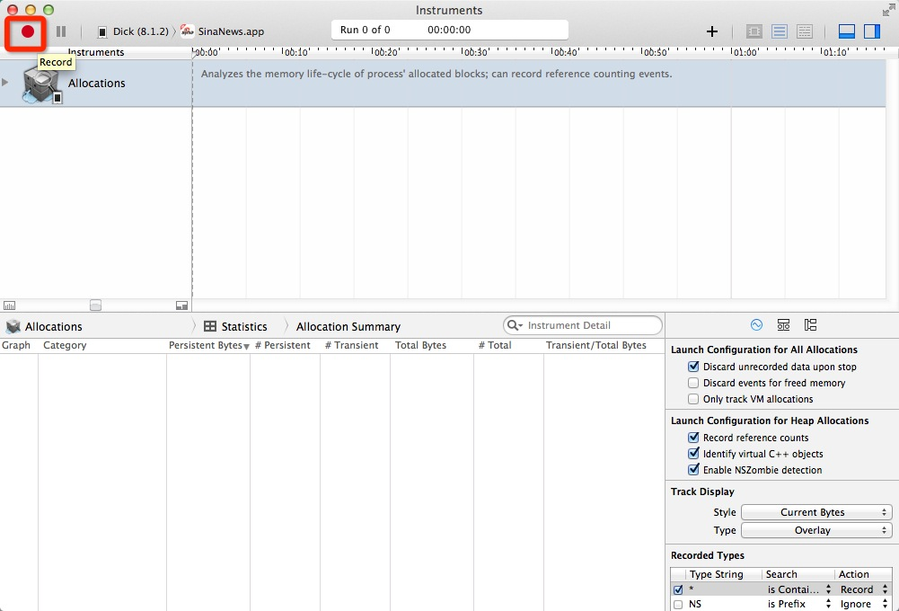
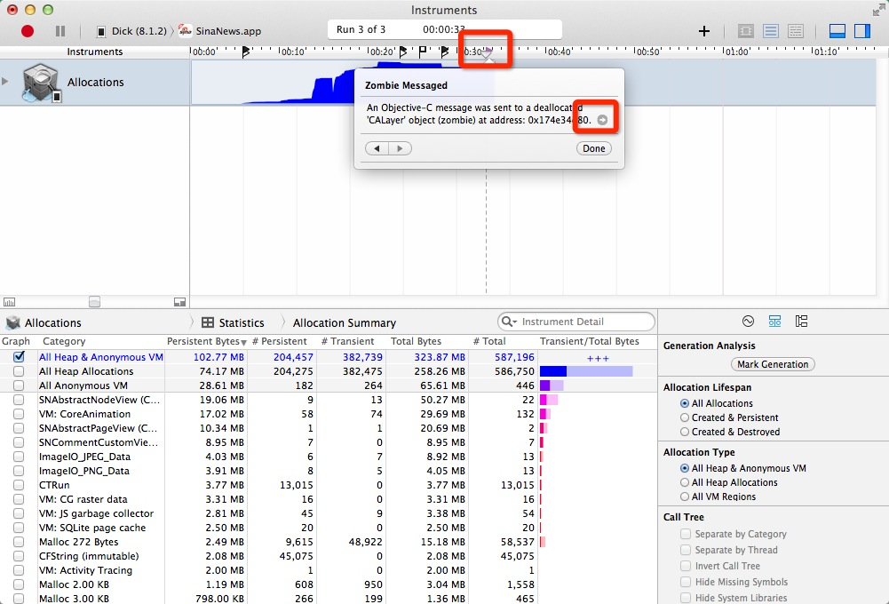
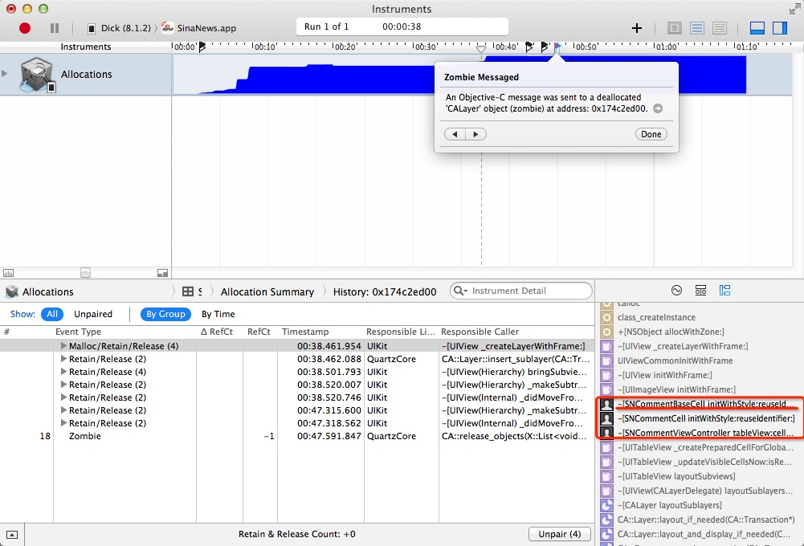
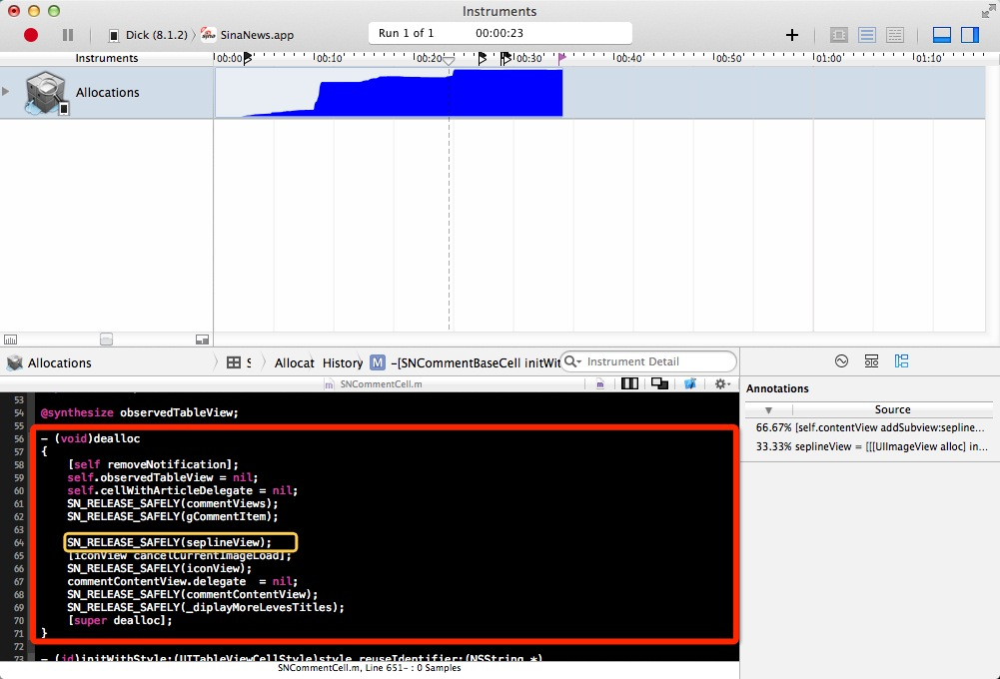

##前言

iOS开发过程中经常遇到一个恶心的问题就是过度释放造成app奔溃。这种Crash出现的log信息量少。而且很难一眼看到问题出现在什么地方。唯一知道的信息就是这个Crash是因为内存管理不当过度释放的问题。这时候我们很多人（我也在其中）的解决方案时根据操作出现的奔溃来猜测可能时哪里的问题，然后去一行行review代码（体力活啊）。之前我一直用这种方法。这个方法在涉及到模块代码量不是很大的情况下还是计较有效的。但是一旦涉及到的代码量很大的情况比较复杂的情况下这种方法会让你抓狂。代码太多涉及到的文件很多你根本不知道哪里地方出问题了。在这种情况下你要想使用一行行review代码的方法那将花费你很多的时间还不一定能找到问题出在哪里。在这个过程中你会抓狂很多次，小伙伴们有没有。好了干货来了。接下来我们来看一下一种高效调试这种Cras的方法。

首先打开你的Xcode 修改scheme为debug模式（使用instruments进行调试时默认配置是release模式）
如下图

1.打开修改scheme界面

2.修改scheme调试模式

3.使用Profile模式运行你的App

4.选择Zembies

5.开始调试

6.按照你之前的操作复现Crash。Crash复现后回出现一个紫色的箭头点击会弹出Zembie Messaged框如图

7.点击6中Zembie Messaged框的箭头跳转到如下视图。

8.看到7中标准的红色框内点击最上面的那个横线会转到你有问题的代码里面如下图

看到这里你里面就明白了原来问题出在这里啊。是不是很方便呢。到这里我们就介绍完了如何解决过度释放造成的Crash。

参考链接

[Stack Overflow](http://stackoverflow.com/questions/7402171/calayer-release-message-sent-to-deallocated-instance)

