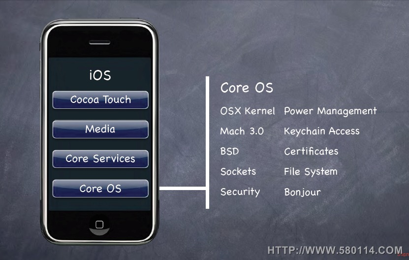

iOS 系统架构如图

一、核心操作系统层(Core OS layer):

> + Core OS是用FreeBSD和Mach所改写的Darwin
> + 提供了硬件驱动, 内存管理,程序管理,线程管理(POSIX),文件系统,网络(BSD Socket),标准输入输出等功能

二、核心服务层(Core Services layer):

> + 电话本(AddressBook.framework)
> + 核心基础框架(CoreFoundation.framework)
> + CFNetwork(CFNetwork.framework)
> + 核心位置框架(CoreLocation.framework)
> + 安全框架(Security.framework)
> + SQLite
> + 支持XML

三、媒体层(Media layer):

> + 图像技术(Graphics Technologies)
> 
>> 1. Quartz。核心图像框架(CoreGraphics.framework)
>>2. 核心动画（Core Animation）
>>3. OpenGL ES

>+ 音频技术(Audio Technologies)

>>1. 核心音频（Core Audio Family）
>>
    |框架(Framework) | 服务(Service) |
    |-------------  | --------------|
    |CoreAudio.framework |定义核心音频的音频数据类型
    |AudioUnit.framework |提供音频和流媒体文件的回放和录制，并且管理音频文件和播放提示声音
    |AudioToolbox.framework |提供使用内置音频单元服务，音频处理模块
>>
>>2. OpenAL
>>

>+ 视频技术(Video Technologies)

四、可触摸层(Cocoa Touch layer):

>+ UIKit框架(UIKit.framework)
>+ 基础框架(Foundation.framework)
>+ 电话本UI框架(AddressBookUI.framework)

[参考资料](http://www.cnblogs.com/zhangmangyuan/archive/2013/03/28/iOS.html)

